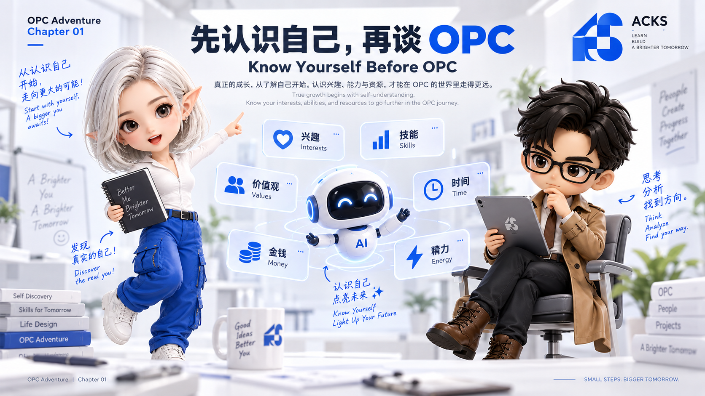
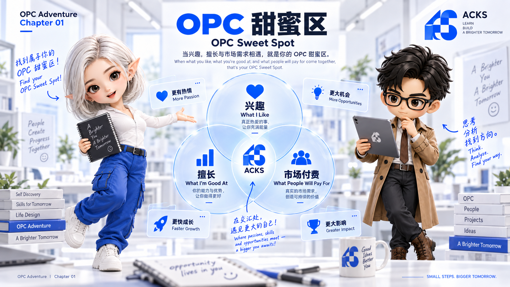
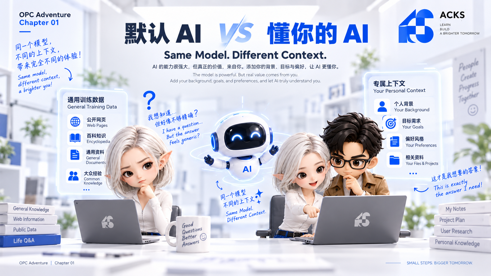
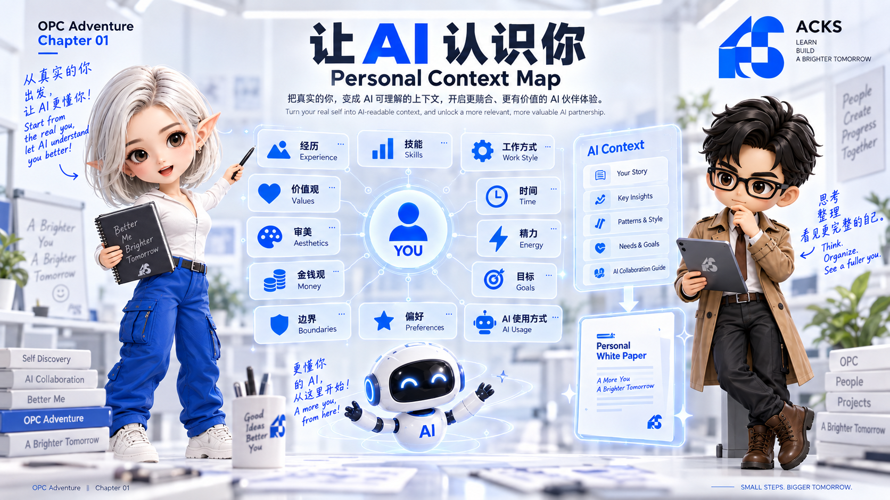
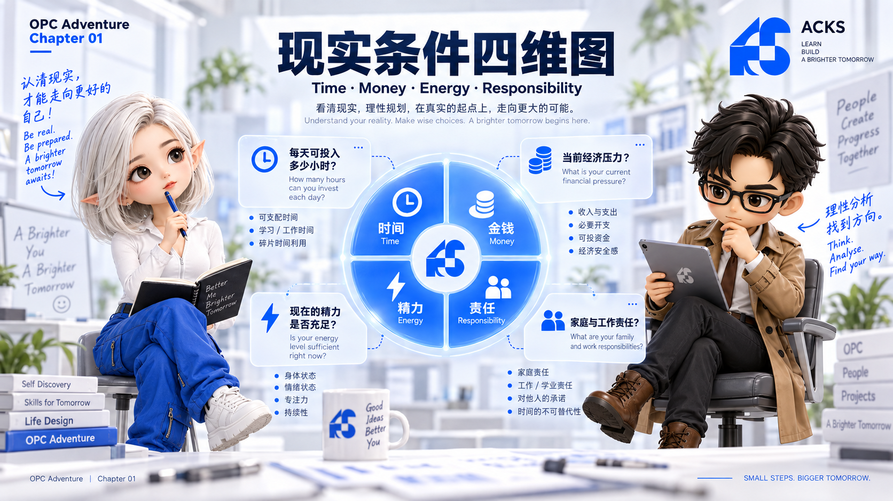
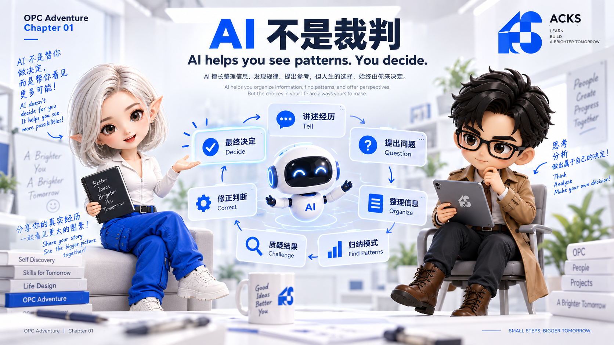
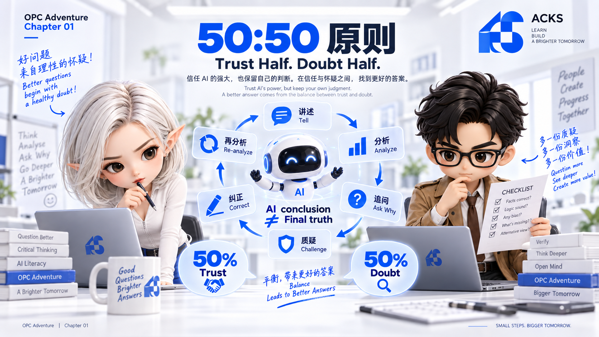
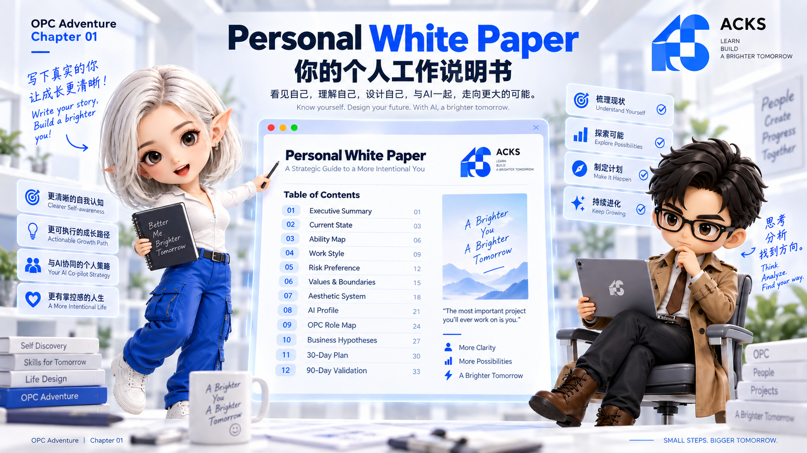
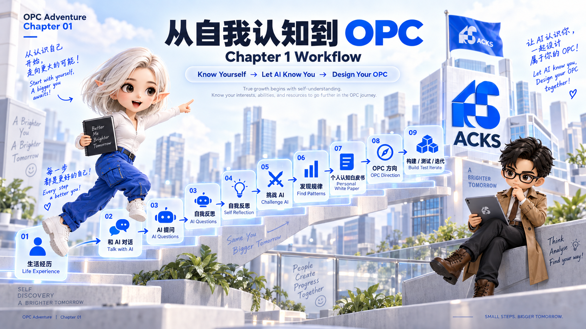

# 第一章：先认识自己，再谈 OPC

> 在真正讨论赛道、工具、产品和 Agent 之前，先把"你是谁、你擅长什么、你愿意长期做什么"这件事梳理清楚。

在真正开始讨论 OPC 之前，有一件事情我觉得比选赛道、学工具、研究 AI 都更重要：先认识你自己。你需要先搞清楚自己喜欢什么样的工作，擅长什么样的事情，希望以什么样的方式工作，以及究竟愿意为什么事情长期投入时间和精力。

OPC 和过去找一份工作、进入一家公司上班，是两套完全不同的逻辑。做 OPC 往往意味着你要投入更多时间、精力和主动性，没有公司替你规定岗位，也没有明确的职位描述告诉你每天该做什么。所以一个比较理想的状态，是尽可能让你想赚钱的方向、你真正感兴趣的事情，以及你本身擅长的能力产生交集。这三个东西重合得越多，后面做 OPC 就越顺。这个交集，就是你的 **OPC 甜蜜区**。

## 先找到自己真正擅长的东西

比如你很擅长写文字，那么在设计自己的 OPC 时，就可以自然地往内容、文案、知识整理、品牌表达这些方向靠。你可以为自己的 OPC 建立知识库和文案库，整理自己的写作风格，慢慢训练出一套只属于自己的内容生产体系。

为什么这件事重要？因为如果你只是打开一个 AI，让它帮你写一篇产品介绍文案，在没有任何额外信息的情况下，它通常只能给你一个"平均答案"。AI 看过大量的小说、散文、教材、说明书、新闻、广告文案，但也正因为学习了太多不同类型的内容，当你没有给它足够明确的偏好、背景和标准时，它往往会倾向于给出一种平均化的结果。这样的内容通常不能说错，但也很难有什么真正鲜明的特点。

如果你本身就会写作，情况完全不一样。首先，你已经具备一个能力：知道什么文字是好的，什么是不好的。一个长期写东西的人，通常会逐渐形成自己的文字审美。你可能说不出一整套理论，但能感觉到哪里俗套、哪里啰嗦、哪里不像人说话、哪里没有节奏，这本身就是很重要的判断能力。

其次，你自己过去写过的文章、笔记、文案，都是非常有价值的材料。你可以让 AI 分析你习惯怎么组织句子、喜欢什么样的节奏、讨厌哪些表达、经常用哪些结构，把这些慢慢整理成规则、要求和风格库。之后再让 AI 帮你写东西，得到的结果自然会比一个完全没有经过训练和约束的 AI 更接近你本人，开始有一些属于你的味道。

写作只是一个例子，设计、摄影、销售、产品、运营、技术，本质上都是一样的道理。

## 想让 AI 了解你，你就得先告诉它你是谁

很多人希望 AI 越来越懂自己，但这里有一个很简单的逻辑：AI 能了解你多少，很大程度上取决于你跟它聊过多少关于你自己的事。如果你从来没告诉过它你的经历、习惯、审美、价值判断和工作方式，却希望它突然很懂你，这当然不现实。

所以我建议在正式开始 OPC 之前，专门花一些时间和 AI 聊自己，比如从自己的成长经历聊起。这并不意味着要把所有隐私都告诉 AI。如果你对隐私和安全有顾虑，完全可以脱敏处理：没有必要告诉它自己在哪所小学读书，也没必要告诉它曾经在哪家具体公司工作。真正有价值的，是那些经历对你产生了什么影响。

比如小时候发生过什么让你印象很深的事情，遇到事情时你当时是怎么处理的，有没有在哪些事情上获得过认可，有没有参加过绘画比赛、演讲比赛、体育活动或者其他长期感兴趣的事。工作以后你做过什么类型的工作，具体怎么做的，做了多少年，你觉得自己真正学到了什么，什么事情让你感觉特别疲惫，为什么最后选择离开，为什么现在开始考虑 OPC。

这些问题真正有价值的地方，不是帮你建立一份履历，而是帮你慢慢找到一些重复出现的模式。

## 不只是聊工作，还要聊你怎么看这个世界

接下来可以继续往深处聊，比如你怎么看赚钱、怎么看上班、怎么看创业、怎么看家庭。你觉得什么东西是美的，喜欢什么颜色、什么样的画面、什么样的网站，喜欢哪些品牌，为什么有人喜欢苹果，有人喜欢 Google，有人喜欢三星。如果你喜欢摄影，你最喜欢哪些摄影师，喜欢他的色调、构图、题材，还是他观察世界的方式。你喜欢读什么样的文章，什么样的文字会让你觉得舒服，什么样的表达会让你反感。

这些问题表面上和 OPC 没有直接关系，实际上都在描述同一个东西：你是谁。一个人的工作方式、审美、价值判断、风险偏好和生活状态，本来就不是彼此独立的，它们最终都会影响你做什么产品、选择什么市场、用什么方式表达、愿意服务什么样的人，以及能不能长期坚持下去。

## 还要把现实条件一起告诉 AI

除了性格和偏好，还需要把自己的现实状态一起梳理出来。比如你现在每天能投入多少时间，是每天只有两三个小时，还是已经完全离职、可以全职投入；你现在只是开始了解 OPC，还是已经准备真正开始做；有没有辞职计划，是准备先把 OPC 跑通再考虑辞职，还是已经没有其他工作、可以全身心投入；目前有没有经济压力，能接受多长时间没有明显结果。

这些都很重要，因为同样一条路，对不同的人来说实际可行性完全不同。一个每天只能拿出两个小时的人，和一个每天可以投入十个小时的人，不应该用完全相同的计划。所以讨论 OPC 时，不能只讨论"应该做什么"，还必须讨论：以你现在的状态，什么事情是你真正做得到的。

## 可以重点跟 AI 聊哪些问题

如果一开始完全不知道从哪里聊起，可以从几个方向开始：性格与工作方式（独立工作还是团队合作，习惯快速决定还是需要大量信息，风险偏好是什么，喜欢稳定推进还是短时间高强度冲刺）；时间与精力（每天究竟有多少可自由支配的时间，什么时间段精力最好，哪些事特别容易让你疲惫，能不能长期保持固定节奏）；任务偏好（喜欢研究问题还是执行，喜欢创造内容还是整理系统，喜欢销售还是抗拒销售，是否喜欢直接面对客户，是否习惯公开表达，愿不愿意经营个人品牌）。

还有长期反馈与短期反馈：你是不是一个能长期投入、等待结果的人，还是必须经常获得短期反馈才能维持动力。这两种人没有谁更好，但适合的 OPC 策略会很不一样。以及审美和表达：喜欢什么视觉风格，什么语言风格，有哪些品牌让你特别有感觉，有没有一些网站、产品、摄影作品或文章是你反复愿意看的，为什么喜欢。很多时候，你真正的偏好就藏在这些答案里。

完整的问题清单整理在了本章末尾的附录里，可以当作聊天主题库，不用一次问完，也不用严格按顺序。

## AI 不是裁判，它只是帮助你归纳

这里有一个很重要的原则：我们跟 AI 聊这些事，不是为了让它最后宣布"你就是一个什么样的人"，然后我们照单全收。真正有价值的过程，是在长期对话中把自己的经历、想法、偏好和矛盾一点点说出来。很多时候，当一个人开始认真讲述自己时，大脑也在同时整理这些东西。有些想法你之前只是模模糊糊地感觉到，但当你把它说出来、解释给另一个对象听的时候，反而会突然意识到：原来我真正介意的是这个，原来我一直想做的是这个，原来我讨厌的不是这份工作，而是这种工作方式。

AI 在这里更像一个协助者，负责听、追问、整理、归纳，寻找重复出现的模式。但最终做判断的人，仍然应该是你自己。

这一章我没有把自己用这套方法梳理自己的具体过程写出来。原因很简单：这部分内容因人而异，而且往往涉及很私人的经历。这有点像我可以推荐朋友去看哪位心理医生，也可以建议他怎么跟医生沟通才能问出自己真正想要的答案，但不会把我自己和医生聊过什么讲给他听。真正重要的是这份问题清单和这套追问方法本身有没有效，而不是我在这套方法里得出了什么结论。

## 对 AI 的结论，永远保持 50:50

我自己比较建议一种态度：对于 AI 给出的分析，永远保持 50:50，信一半，也不信一半。不要因为 AI 的回答听起来很合理，就立刻把它当成结论。它说你适合做某件事，你可以问为什么，判断依据是什么，是哪几段经历让它得出这个结论，有没有可能存在另一种解释。它说你不适合某件事，也一样继续追问。甚至哪怕答案非常符合你的想法，依然可以问它：你为什么会这样判断？因为我们真正需要了解的，不只是它给出的结论，还包括它得出结论的依据。

这也是为什么我不建议只进行一轮对话。真正有价值的自我梳理应该是一个多轮迭代的过程：AI 提出一个判断，你觉得不准确就纠正它，它根据新信息重新归纳，你继续补充。如果有些事连你自己都说不清对错，就让它同时给出几种不同解释，再看看哪一种更接近你的真实感受，一点一点往下挖。

## 最终交付：一份 Personal White Paper

当对话进行到一定程度后，可以让 AI 帮你整理出一份完整文档，我暂时把它叫做 Personal White Paper，个人白皮书。它不是简历，不是人格测试报告，更不是让 AI 给你贴几个标签，而应该是一份关于你自己的工作说明书，里面包括你的经历、能力结构、擅长和不擅长的事、兴趣、工作习惯、风险偏好、决策方式、审美偏好、语言风格、可投入时间、当前生活状态、长期目标、容易消耗你的事情、能持续给你动力的事情，以及基于这些信息，在 OPC 中你可能更适合承担哪些角色。

有了这份底稿，之后再讨论选什么赛道、做什么产品、怎么建立工作流、哪些事自己做、哪些交给 Agent、哪些能力需要补，整个讨论就有了一个真正属于你的基础，而不是从网上找一套"成功 OPC 模板"硬套在自己身上。

本章附上一份可以直接使用的 Personal White Paper 模板（见 [`templates/personal-whitepaper-template.md`](../templates/personal-whitepaper-template.md)），把它复制一份，保存为你自己的 `personal-whitepaper.md`，随着你和 AI 的交流不断修改。

这份文档最重要的价值，不是给自己一个定义，而是允许被不断推翻和修改。半年之后，你可能会发现自己之前认为擅长的事，其实只是做得比较久；也可能发现自己一直没认真对待的一项兴趣，反而是最值得商业化的能力。它应该是一份 Living Document，而不是一次性写完就封存的结论。AI 可以帮你整理、发现矛盾、提醒你过去说过什么，但最后决定自己是谁、愿意做什么、愿意承担什么后果的人，始终应该是你自己。

## 模型不用最贵，但最好具备推理能力

做这类对话时，我觉得没必要一上来就用最顶级、最贵的模型，但有一个条件比较重要：最好用具备一定深度思考和推理能力的模型。原因很简单：整个过程中我们会不断追问为什么，判断依据是什么，还有没有其他可能，前后两个判断有没有矛盾，是不是因为某一句话被过度推断了。这些都需要模型具备一定的推理能力。我们不是为了让它说得漂亮，而是希望它能真正参与到梳理过程里面。

## 这一章真正要完成的事情

所以这一章，我真正想解决的并不是"什么是 OPC"，而是另一个问题：在开始 OPC 之前，你到底了解不了解自己。如果你完全没有头绪，就从和 AI 聊天开始：把你的经历、偏好、能力、现实状态和各种想法一点一点告诉它，让它问你问题、总结、提出判断，然后你质疑它、纠正它、继续补充，不断迭代，直到最后共同整理出一份属于你的 Personal White Paper。

至于怎么具体展开这样一场对话，本章提供了一段可以直接使用的开场白（见 [`prompts/chapter-01-self-discovery-opener.md`](../prompts/chapter-01-self-discovery-opener.md)）。怎么追问、怎么纠正、最终该让 AI 交付一份什么样的东西，这段提示词本身已经把规则写清楚了。真正要做的示范，不是我把自己的答案摆出来，而是你自己坐下来，问出第一句话。

因为 OPC 的第一步，不是马上研究工具，也不是马上找项目，而是先认识你自己，然后再让 AI 开始认识你。当这两件事完成以后，我们才真正有资格继续讨论：你应该建立一个什么样的 OPC。

---

# 附录：与 AI 进行自我认知对话的完整问题清单

这份清单不是心理测评，也不是考试。你不需要一次回答完，也没有所谓"标准答案"。更好的方法是把它当成一系列聊天主题，每次选择一个部分，和 AI 连续聊 20～40 分钟。遇到值得深入的问题就停下来继续追问，不要为了完成清单而赶进度。

同时建议遵循三个原则：

1. **能脱敏就脱敏。** 不需要为了让 AI 了解你，而主动暴露姓名、地址、公司名称、学校名称、账号、身份证明等没有必要的隐私。
2. **尽量用真实经历回答。** 与其说"我觉得自己执行力很强"，不如讲一个真实案例，让 AI 从行为里归纳。
3. **所有结论都允许被推翻。** 每得到一个重要判断，都可以要求 AI 给出证据、反例和其他解释。

## A1. 当前状态

1. 你现在处于什么样的生活阶段？
2. 你目前是全职工作、兼职、自由职业、创业，还是暂时离职？
3. 你为什么会开始考虑 OPC？
4. 是什么事情让你觉得现在的工作方式需要改变？
5. 你目前最想解决的三个问题是什么？
6. 如果未来一年什么都不改变，你最担心发生什么？
7. 如果未来一年进展顺利，你希望自己的生活变成什么样？
8. 你现在每天、每周真正可以自由支配多少时间？
9. 目前有哪些现实责任会限制你的选择？
10. 你现在最稀缺的是时间、资金、技能、精力、资源，还是方向感？

## A2. 成长经历与关键节点

11. 小时候你最喜欢做什么事情？
12. 哪些事情是不需要别人催，你自己就愿意反复做的？
13. 小时候你在哪些事情上得到过认可？
14. 有没有参加过比赛、社团、活动或长期兴趣项目？
15. 哪些经历曾经明显改变过你？
16. 有没有一件事情让你第一次觉得"原来我很擅长这个"？
17. 有没有一件事情让你第一次意识到"这种生活不是我想要的"？
18. 过去有哪些决定，现在回头看仍然觉得是正确的？
19. 有哪些决定让你后悔？为什么？
20. 过去五到十年，你的价值观发生过哪些明显变化？

## A3. 工作经历

21. 你做过哪些类型的工作？
22. 每一段工作里，你真正负责的事情是什么？
23. 哪些任务你完成得明显比周围人更好？
24. 哪些工作别人觉得很麻烦，你却觉得很自然？
25. 哪些事情即使做得不错，你依然非常消耗？
26. 过去最有成就感的一次工作经历是什么？
27. 为什么那件事情会让你有成就感？
28. 过去最痛苦的一段工作经历是什么？
29. 真正让你痛苦的是工作内容、组织方式、人际关系、价值观冲突，还是失去自主权？
30. 你为什么离开上一份工作，或者为什么曾经想过离开？
31. 如果不考虑收入，你还愿不愿意继续做过去的工作？
32. 如果收入翻倍，你是否愿意继续做？为什么？

## A4. 能力结构

33. 你认为自己最擅长的五件事情是什么？
34. 每一项能力，有没有真实案例可以证明？
35. 别人最经常因为什么事情来找你帮忙？
36. 哪些技能是你学得明显比别人快的？
37. 哪些能力你已经持续使用超过三年？
38. 哪些能力虽然目前不强，但你非常愿意继续投入？
39. 你擅长发现问题，还是解决问题？
40. 你擅长从零创造，还是在现有基础上优化？
41. 你更擅长抽象思考，还是具体执行？
42. 你更擅长文字、视觉、数字、逻辑、沟通、组织还是动手实践？
43. 你有哪些能力可以直接转换成商品、服务、内容或咨询？
44. 哪些能力只能算兴趣，目前还不能形成商业价值？

## A5. 学习方式

45. 你通常如何学习一个完全陌生的东西？
46. 你喜欢先看完整教程，还是边做边学？
47. 你更喜欢文字、视频、课程、案例还是直接实践？
48. 遇到不会的问题，你通常会坚持多久？
49. 什么情况下你最容易放弃？
50. 过去有没有一个领域，是你靠自学真正学会的？
51. 当时你是怎么学的？
52. 你是否习惯做笔记、建立知识库或整理方法论？
53. 你更擅长快速入门，还是长期深挖？
54. 你对不断变化的新工具和新技术是兴奋、焦虑，还是抗拒？

## A6. 工作方式

55. 你更喜欢一个人工作，还是团队协作？
56. 你需要明确任务，还是喜欢自己定义问题？
57. 你喜欢同时处理很多事情，还是一次只做一件事？
58. 你习惯先规划再行动，还是先行动再修正？
59. 你更适合固定流程，还是高度自由的环境？
60. 你喜欢快节奏还是慢节奏？
61. 你能否长期执行重复任务？
62. 你是否需要频繁获得反馈？
63. 你是否能够接受一个项目几个月都没有明显成果？
64. 在没有人监督的情况下，你的执行力会变强还是变弱？
65. 什么样的截止日期对你最有效？
66. 你是容易开始但难以坚持，还是难以开始但一旦开始就能长期坚持？

## A7. 决策方式与风险偏好

67. 做重大决定时，你通常依赖数据、经验、直觉还是他人意见？
68. 你需要掌握多少信息才愿意开始行动？
69. 你是否容易因为信息不足而拖延？
70. 你更害怕做错，还是更害怕错过机会？
71. 你能够承受多大的收入波动？
72. 你能接受多久没有稳定收入？
73. 对你来说，多少钱的投入算是"可以试错"？
74. 什么损失是你绝对无法接受的？
75. 你愿意为了更高的长期收益牺牲多少短期稳定？
76. 你更喜欢低风险稳定增长，还是高风险高回报？

## A8. 时间、精力与生活节奏

77. 你一天中什么时候头脑最清醒？
78. 什么时候最适合做深度工作？
79. 一天真正能保持高质量工作的时间有几个小时？
80. 什么事情最容易消耗你的精力？
81. 什么事情反而会让你越做越有精神？
82. 你需要多少睡眠和休息才能维持状态？
83. 你是否适合长期高强度工作？
84. 你有没有家庭、健康、通勤或其他必须长期考虑的现实条件？
85. 你希望 OPC 最终占据你生活的多少比例？
86. 你希望工作融入生活，还是工作和生活尽量分开？

## A9. 金钱观与商业目标

87. 对你来说，赚钱最重要的意义是什么？
88. 是安全感、自由、身份认同、成就感，还是其他东西？
89. 你希望 OPC 最终替代工资收入，还是成为额外收入？
90. 你希望达到什么收入水平？
91. 这个目标背后的现实理由是什么？
92. 你能接受收入增长得很慢吗？
93. 你更喜欢一次性高客单价收入，还是长期订阅和重复收入？
94. 你愿不愿意为了商业收入做自己兴趣一般但擅长的事情？
95. 哪些钱你不愿意赚？
96. 有没有某些商业模式即使赚钱，你也不想参与？

## A10. 客户、销售与人际互动

97. 你喜欢直接和客户交流吗？
98. 你是否愿意主动陌生开发？
99. 你是否抗拒销售？
100. 你是否擅长解释复杂问题？
101. 面对客户质疑时，你通常是什么反应？
102. 你更喜欢服务少量高价值客户，还是大量普通用户？
103. 你喜欢长期客户关系，还是一次性项目？
104. 你能否处理客户的不合理要求？
105. 你是否愿意公开展示自己的专业能力？
106. 如果必须在"做产品"和"卖产品"之间选一个，你天然更偏向哪边？

## A11. 内容表达与个人品牌

107. 你是否喜欢写作？
108. 你是否喜欢拍照、拍视频、录音或直播？
109. 你愿意公开表达自己的观点吗？
110. 你是否介意被陌生人评价？
111. 你愿意露脸吗？
112. 你是否愿意长期经营一个公开账号？
113. 你更擅长教程、观点、故事、评论、案例还是娱乐内容？
114. 什么话题你可以连续讲几个小时都不会觉得烦？
115. 哪些内容即使有流量，你也不愿意做？
116. 你希望别人最终因为什么关键词记住你？

## A12. 审美与表达偏好

117. 你最喜欢什么颜色？
118. 你最不喜欢什么颜色或视觉风格？
119. 你喜欢极简、复杂、工业、古典、现代、科技、复古，还是其他风格？
120. 有没有特别喜欢的品牌？为什么？
121. 有没有特别喜欢的网站或 App？为什么？
122. 你喜欢什么类型的摄影？
123. 有没有喜欢的摄影师、导演、设计师或艺术家？
124. 你喜欢他们作品里的什么？
125. 你喜欢什么样的文字风格？
126. 哪些常见表达会让你觉得俗套或反感？
127. 你希望自己的品牌给人什么感觉？
128. 如果你的 OPC 是一家真实存在的店，它应该是什么样子？

## A13. 价值观与边界

129. 对你来说，工作最重要的意义是什么？
130. 自由、稳定、收入、影响力、创造、尊严、家庭，哪些更重要？
131. 哪些事情是你绝对不愿意为了赚钱牺牲的？
132. 有没有你坚决不愿服务的客户类型？
133. 有没有你不愿进入的行业？
134. 你如何看待加班？
135. 你如何看待快速赚钱？
136. 你如何看待长期主义？
137. 你希望别人如何评价你的工作？
138. 如果商业成功和你的价值观发生冲突，你希望自己怎么选择？

## A14. 动机与持续性

139. 什么事情会让你产生强烈的行动欲望？
140. 你过去真正长期坚持过哪些事情？
141. 为什么那些事情能坚持下来？
142. 哪些事情你曾经很兴奋，但很快就放弃？
143. 为什么会放弃？
144. 你需要外部认可才能持续吗？
145. 你更容易被"想得到什么"驱动，还是被"不想失去什么"驱动？
146. 如果三个月没有收入和增长，你还会继续吗？
147. 如果一年后仍然只是小规模生意，你能接受吗？
148. 你真正想建立的是一份工作、一家公司、一种生活方式，还是个人事业系统？

## A15. 对 AI 的态度与使用方式

149. 你目前最常用 AI 做什么？
150. 你把 AI 当搜索工具、助手、合作者，还是 Agent？
151. 哪些事情你愿意完全交给 AI？
152. 哪些事情必须自己最终把关？
153. 你能不能判断 AI 输出的好坏？
154. 你在哪些领域具备足够专业能力，可以审核 AI？
155. 哪些领域你其实很容易被 AI "说服"？
156. 你是否愿意长期整理自己的知识库、案例库和风格库？
157. 你希望 AI 未来最了解你的哪些方面？
158. 哪些私人信息你永远不希望交给 AI？

## A16. OPC 角色倾向

159. 如果把一个 OPC 拆成产品、技术、内容、营销、销售、客服、运营和管理，你最想承担哪几项？
160. 哪些角色你最不想承担？
161. 哪些角色可以通过 AI 或 Agent 显著增强？
162. 哪些角色即使 AI 能做，你也希望自己掌握？
163. 你更想卖产品、卖服务、卖知识、卖内容、卖工具还是卖资源？
164. 你更倾向 B2B 还是 B2C？
165. 你更希望服务本地市场、中文互联网，还是国际市场？
166. 你更倾向个人品牌驱动，还是品牌隐藏在个人之后？
167. 你希望业务高度自动化，还是保留大量人工服务？
168. 你希望最终成为专家型 OPC、创作者型 OPC、产品型 OPC、服务型 OPC，还是混合型？

## A17. 反向排除

169. 什么样的工作方式你绝对不想再经历？
170. 什么样的客户最让你疲惫？
171. 什么样的项目即使赚钱，你也很难长期做？
172. 哪些任务会明显让你拖延？
173. 哪些行业文化让你不舒服？
174. 什么样的商业模式与你的生活目标冲突？
175. 如果 OPC 最终变成另外一份"996 工作"，你是否还能接受？
176. 有哪些所谓成功方式，你明确不想复制？

## A18. 最终验证问题

在前面的对话完成以后，可以再让 AI 用下面的问题验证自己的结论：

177. 你目前对我的三个核心判断是什么？
178. 每个判断分别基于哪些具体信息？
179. 哪些判断证据充分，哪些只是推测？
180. 有没有被我重复表达、但实际上缺乏行为证据的"自我评价"？
181. 我的叙述中有没有明显矛盾？
182. 有没有我自己没有注意到的重复模式？
183. 有哪些结论存在两种以上合理解释？
184. 请分别给出支持和反对你当前判断的证据。
185. 如果完全不考虑我的主观自我评价，只根据真实经历，你会得出什么结论？
186. 哪些信息还不足以判断，需要继续提问？
187. 你认为我最容易高估自己的地方是什么？
188. 你认为我最容易低估自己的地方是什么？
189. 哪些职业或商业方向目前证据不足，不应该过早下结论？
190. 如果半年后重新评估，最应该观察哪些真实行为和数据？

## References

本章内容为方法论总结与实践问题清单，不涉及需要标注来源的外部事实或数据，暂无引用来源。
